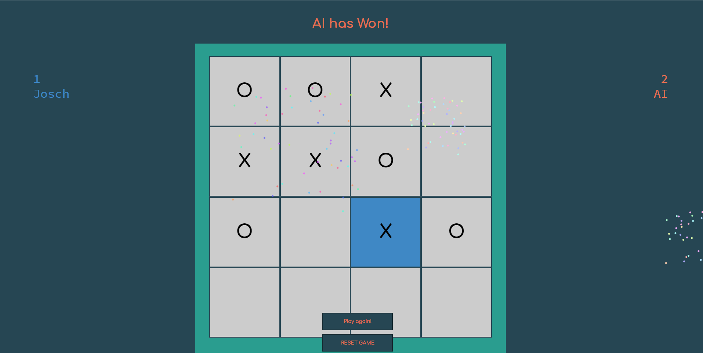
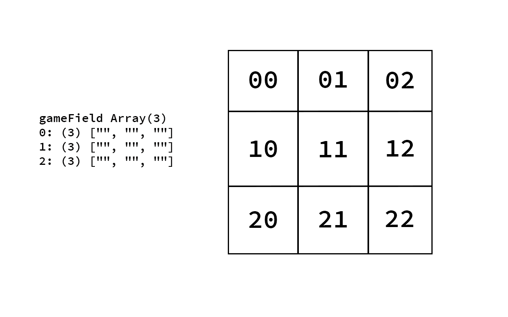
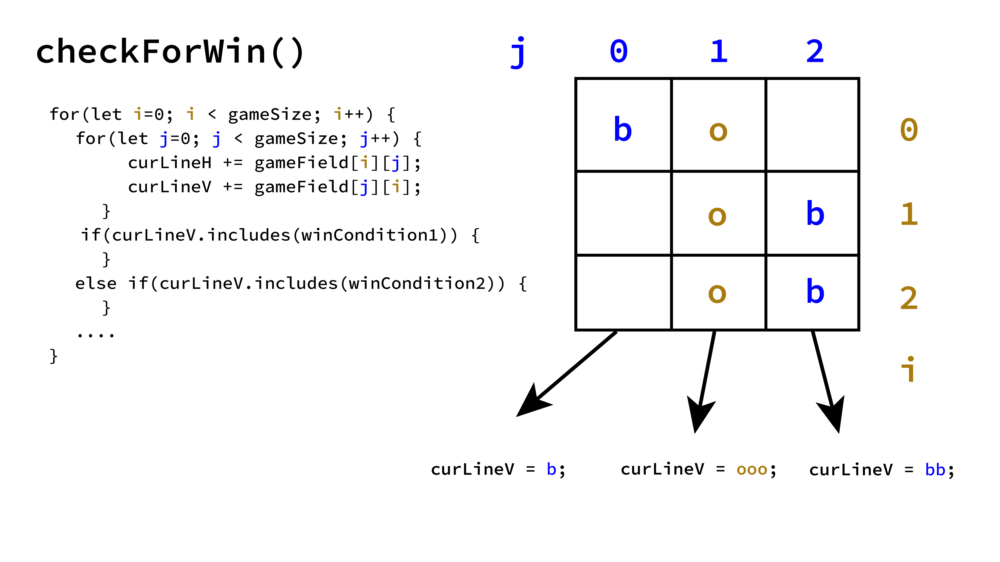
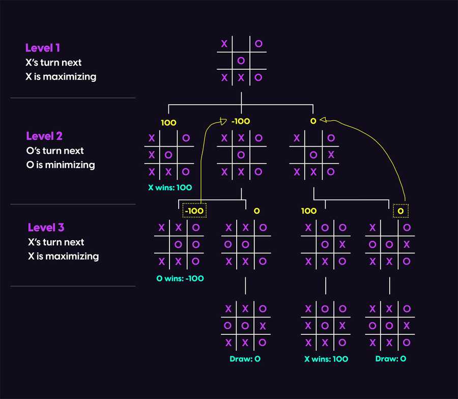

# Tic Tac Toe mit integrierter Minimax AI

TicTacToe im Browser spielen? Ähnlich revolutionär wie die Klimapolitik der CDU! Dieses Projekt enstand im Rahmen des Kurses Programmiersprachen I an der HfG Schwäbisch Gmünd. 
Bestandteil des Projektes sind variable Spielregeln (Spielfeldgröße, Punkte die benötigt sind um zu gewinnen etc.) und ein Spielmodus gegen eine AI. 

### Inspirationen:

* [Coding Challenge 154: Tic Tac Toe AI with Minimax Algorithm](https://www.youtube.com/watch?v=trKjYdBASyQ) 
* [Tic-Tac-Toe with JavaScript: AI Player with Minimax Algorithm](https://alialaa.com/blog/tic-tac-toe-js-minimax) 

## Usage / Benutzung

Um TicTacToe spielen zu können ist es nötig das Repository lokal zu klonen und daraufhin tictactoe.html im Browser auszuführen (bevorzugt Google Chrome oder Firefox). Daraufhin sollte sich die Benutzeroberfläche zum Spielen öffnen. 
Achtung! Momentan sind nur begrenzte Spielfeld-Größen möglich (bei Player vs. Player max 10x10, im AI modus max 5x5).

## Structure / Aufbau

### _Wichtige Variablen bei diesem Tic Tac Toe:_ 

* **let gameRunning:** Eine Bool zur Feststellung ob das Spiel momentan "läuft" und in dem Zuge Klicks o.ä. zulässt.
  * `gameSizeXY`: Spielfeld-Größe
  * `p`: pointsToWin, also wieviele gleiche in einer Reihe benötigt sind um ein Spiel für sich zu entscheiden.

* **let gameField = []:** Ein Array um unser Spielfeld status zu Speichern. Wird Verwendet bei: 
  * `checkWin()`: Zur Gewinnermittlung wird das gesamte Array ausgelesen und auf "Gewinnsituationen" überprüft. 
  * `minimax(board, depth, isMaximizing)`: Zum Planen des nächsten AI-Zuges

### _Zentrale Funktionen von diesem TicTacToe:_

`function initUI(gameSizeXY, p)`: Eine Funktion zur generierung des Spielfelds & Grundsatz für die Spiellogik
  * `gameSizeXY`: Spielfeld-Größe
  * `p`: pointsToWin, also wieviele gleiche in einer Reihe benötigt sind um ein Spiel für sich zu entscheiden.

Aufbauend auf dem `gameSize` Wert wird das obig beschriebene `gameField` Array generiert und die sichtbaren Zellen des Spielfelds erstellt und dargestellt. Im Anschluss werden durch die `addEventListeners()` Funktion jedem Feld bzw. jeder Zelle ein Event-Listener für Hover- und Clickevents zugewiesen. Die Event-Listener für Click Events sind für jedes Feld einzigartig, da sie beim Click ihre eigene ID übergeben, um diese später in der `handleGridClick(selGrid)` Funktion auszuwerten können.
Die ID's stehen in direkter Verbindung zum `gameField` Array, wie diese Grafik zeigt:

`function handleGridClick(selGrid)`: Diese Funktion wird dann aufgerufen, wenn der Spieler auf eine der Zellen drückt und somit den Event-Listener dieser Zelle triggert. Der Funktion wird die selGrid (kurz für selected Grid) Variable übergeben, in diesem Fall die ID der Zelle. Daraufhin folgt die Überprüfung ob die gewählte Zelle leer ist. Sollte dem so sein, wird die Zelle mit dem Zeichen des `teamToMove` also dem aktiven Spieler besetzt. Sobald alle Style und Logik Anpassungen für den nächsten Zug getroffen wurden, wird durch die `checkForWin()` Funktion ermittelt, ob es einen Gewinner gibt.

`function checkForWin()`: Eine Funktion um den Status des aktuellen Spielfelds auszuwerten und mögliche Gewinne zu ermitteln.  Zunächst werden die zwei Siegesbedingungen (`winCondition1` & `winCondition2`) gesetzt, indem das Team Symbol (momentan o & b für orange und blau) so oft wiederholt wird, wieviele [pointsToWin](#Zentrale-Funktionen-von-diesem-TicTacToe) benötigt sind. Folgende drei Gewinnmöglichkeiten sind jeweils separiert: vertikaler, horizontaler oder diagonaler Gewinn, die grundlegende Logik bleibt jedoch die Selbe: Es wird das ganze Spielfeld Zeile für Zeile betrachtet (*Anmerkung: Hier könnte sich ein vermeindliches Bottleneck für größere/tiefere AI-Spiele befinden*) und in die Strings `curLineV`, `curLineH`, `curLineD` und `curLineD2` geschrieben.  Daraufhin wird überprüft ob einer dieser Strings unserer Siegesbedingungen enthält.

 
Bei der diagonalen Gewinnüberprüfung, muss zunächst festgestellt werden ob ein solcher Gewinn überhaupt möglich ist (man also nicht Werte abfragt die außerhalb des Arrays liegen). Der Prozess danach verläuft jedoch ähnlich. Siehe <a href="https://github.com/hfg-joschua-r/programmiersprachen1JoRo/blob/7bd6ce1d5965dc0d9dbfba54d14a85fdf3479dfd/ticTacToe/ticScript.js#L294-L334">Line 294-334</a>.  

`function bestMove()` & `function minimax(board, depth, isMaximizing)` Sind Funktionen welche für die Züge der AI zuständig sind. 
* `board`: Hier wird unser `gameField` Array mit den aktuellen Werten übergeben.
* `depth`: Die aktuelle Tiefe im Baum.
* `isMaximizing`: Bool ob der nächste Zug vom Spieler oder der AI getätigt wird.

Es werden alle möglichen Züge der AI innerhalb einer For-Schleife gesammelt und einzeln bewertet. Bewertet werden die Züge danach, dass sich ein Baumdiagramm aufstellt mit möglichen nächsten Zügen des Spielers und möglichen "Antworten" der AI. Gewinne der AI werden als 100 Punkte gewertet, Siege des Spielers als -100 und Unentschieden als 0. Wie tief dieser Baum geführt wird ist mit der Variable `maxDepth` festgelegt. 

Wenn der beste Zug mit dem besten "Score" ermittelt wurde, wird dieser durch die Funktion `function changePlayer(x, y)` gespielt und auf den Zug des Spielers gewartet.

### _Zusammenfassung von diesem Tic Tac Toe_

Der User kann zunächst zwischen zwei Modi wählen, dem Spieler vs. Spieler Modus und dem Spieler vs. AI Modus. Bei beiden Modi kann der User die Spielernamen, Spielfeldgröße, und die benötigte Anzahl an Punkten die für einen Sieg benötigt sind festlegen. Im AI-Modus lässt sich auch noch zwischen den Schwierigkeitsgraden Leicht, Mittel und Schwer wählen. Das Spiel wird nun durch die Funktionen `settingsMenu()` oder `aiMode(difficulty, playAgain)` gestartet. 

Während des Spiels werden klicks über EventListener registriert und in den Funktionen `handleGridClick()` und `checkForWin()` ausgewertet.

Nach dem Abschluss einer Runde werden die Punkte des jeweiligen Teams, bis zu einem Reload gespeichert und angezeigt. Es wird die Möglichkeit gegeben ein Rematch zu haben oder das Spielfeld zurückzusetzen und neue Spielregeln zu wählen.

## Mögliche Erweiterungen

Was noch fehlt, und was die nächsten Schritte wären um es ggf. umzusetzen:
* Erweiterung der AI mit der [Alpha-Beta-Suche](https://de.wikipedia.org/wiki/Alpha-Beta-Suche) 
* AI mit Machine Learning 
